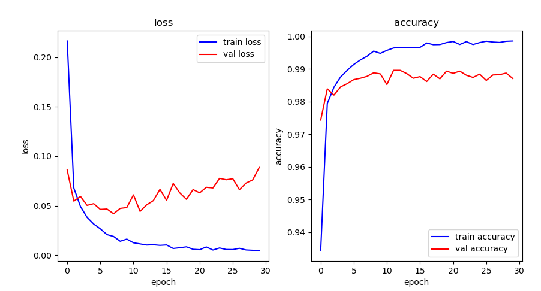
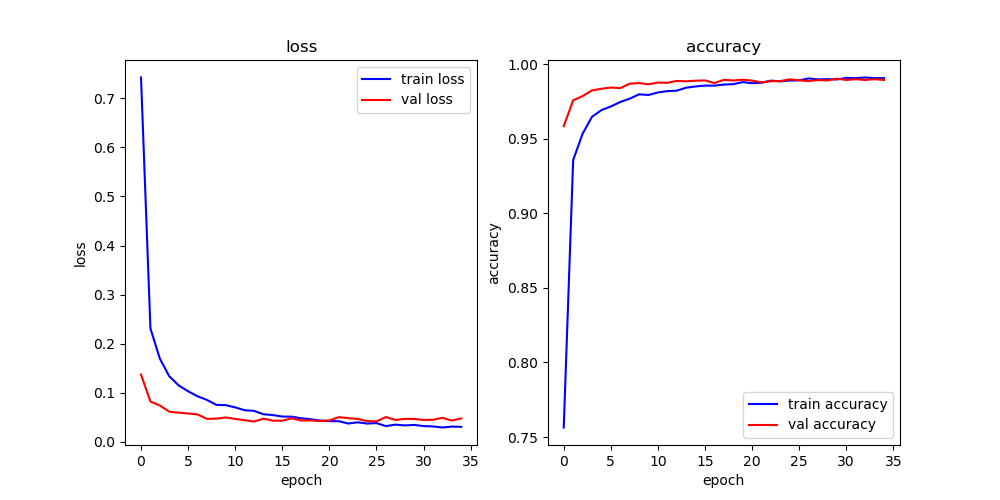

## 아키텍처

1. input - (32, 32, 1)
    - Conv - 5x5 filter 6개
2. Layer C1 - (28, 28, 6)
    - Pooling - 2x2 filter 6개
3. Layer C2 - (14, 14, 6)
    - Conv - 5x5 filter 16개
4. Layer C3 - (10, 10, 16)
    - Pooling - 2x2 filter 16개
5. Layer S4 - (5, 5, 16)
    - Conv - 5x5 filter 120개
6. Layer C5 - (120)
    - Dense
7. Layer F6 - (84)
    - Dense
8. output - (10)

## 데이터셋
- MNIST 데이터셋 활용
- 28 x 28 흑백이미지

28x28의 크기를 zero-padding 32x32로 바꿔 model에 집어넣는다. 

## 결과
- 모델

- 결과

- train  
    loss: 0.0047  accuracy: 0.9986 
- val    
    loss: 0.0887  accuracy: 0.9871
- test   
    loss: 0.0735  accuracy: 0.9893
    
overfitting현상이 나타난다.

#### Dropout Layer 추가
- 모델

- 결과

- train  
    loss: 0.0306  accuracy: 0.9908 
- val    
    loss: 0.0476  accuracy: 0.9895
- test   
    loss: 0.0313  accuracy: 0.9917